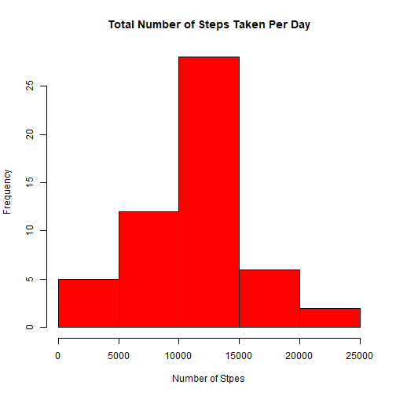
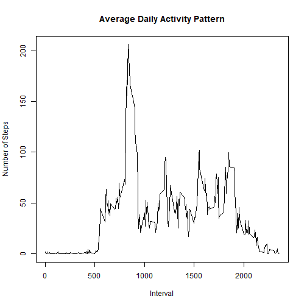
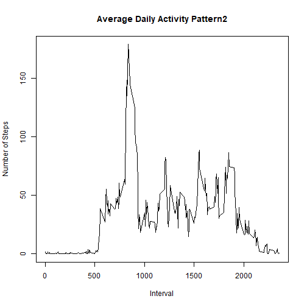
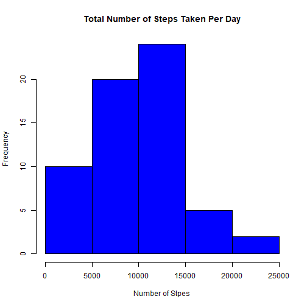
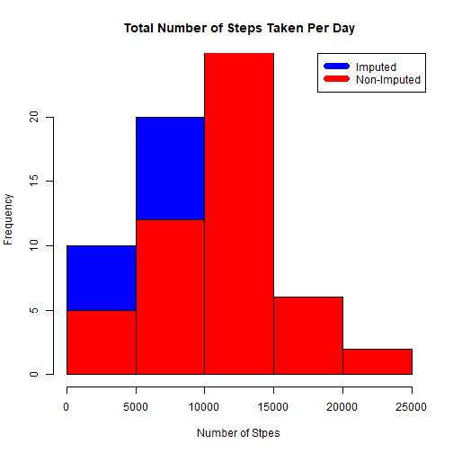
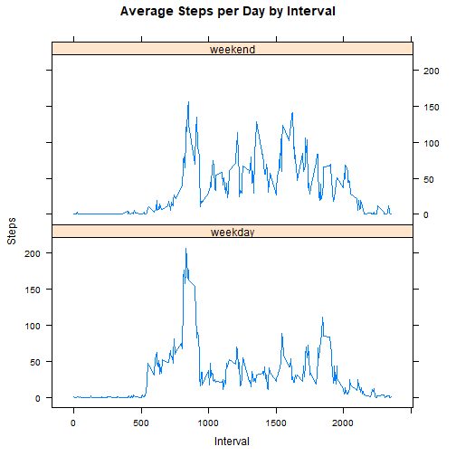

## Load data from csv file

```r
D <- read.csv("activity.csv")
```

## Calculate the total number of steps taken per day
### aggregate steps by date from D

```r
steps_day <- aggregate(steps ~ date, D, sum)
```
### make histogram

```r
hist(steps_day$steps,main="Total Number of Steps Taken Per Day",
     col="red", xlab = "Number of Stpes")
```


### mean of steps

```r
steps_mean <- mean(steps_day$steps)
steps_mean
```

```
## [1] 10766.19
```
### median of steps

```r
steps_median <- median(steps_day$steps)
steps_median
```

```
## [1] 10765
```

## Calculate the average daily activity pattern
### aggregatae steps by interval

```r
daily <- aggregate(steps ~ interval, D, mean)
```
### plot

```r
plot(x=daily$interval, y=daily$steps,
     main= "Average Daily Activity Pattern", xlab = "Interval", ylab="Number of Steps",
     type="l")
```


### find maximum steps

```r
daily_max <- daily[which.max(daily$steps),]$interval
```

## Imputing missing values. Compare inputed to non-imputed data
### locate and the number of missing values 

```r
missing <- which(is.na(D$steps))
Nmissing <- length(missing)
```
### create a new dataset D2 to replace missing values with 0

```r
D2 <- D
D2[missing,]$steps <- 0
```
### repeat step3 with D2

```r
daily2 <- aggregate(steps ~ interval, D2, mean)
```
### plot

```r
plot(x=daily2$interval, y=daily2$steps,
     main= "Average Daily Activity Pattern2", xlab = "Interval", ylab="Number of Steps",
     type="l")
```


### replcae 0 with mean of that interval from all days

```r
for (mm in 1:Nmissing){
  this_interval <- D2[mm,]$interval
  this_mean <- daily2[which(daily2$interval==this_interval),]$steps
  D2[mm,]$steps <- this_mean
}
```
### repeat step2 with D3

```r
steps_day2 <- aggregate(steps ~ date, D2, sum)
hist(steps_day2$steps,main="Total Number of Steps Taken Per Day",
     col="blue", xlab = "Number of Stpes")
```




```r
steps2_mean <- mean(steps_day2$steps)
steps2_mean
```

```
## [1] 9542.932
```

```r
steps2_median <- median(steps_day2$steps)
steps2_median
```

```
## [1] 10056
```
### difference between steps_day and steps_day2

```r
hist(steps_day2$steps,main="Total Number of Steps Taken Per Day",
     col="blue", xlab = "Number of Stpes")
hist(steps_day$steps,main="Total Number of Steps Taken Per Day",
     col="red", xlab = "Number of Stpes",add=T)
legend("topright",c("Imputed","Non-Imputed"),col=c("blue","red"),lwd=7)
```




```r
diffmean <- steps2_mean - steps_mean
diffmean
```

```
## [1] -1223.257
```

```r
diffmedian <- steps2_median - steps_median
diffmedian
```

```
## [1] -709
```

```r
difftotal <- sum(daily2$steps) - sum(daily$steps)
difftotal
```

```
## [1] -1411.959
```

## Compute differneces in activity patterns between weekdays and weekends

```r
weekdays <- c("Monday","Tuesday","Wednesday","Thursday","Friday")
```
### add variable of weekdays/ weekends

```r
D3 <- data.frame(D2,day=0)
for (dd in 1:length(D3$day)){
  dayhere <- as.character(weekdays(as.Date(D3[dd,]$date)))
  if (length(which(dayhere==weekdays))==1){
    D3[dd,]$day <- "weekday"
  }
  else if (length(which(dayhere==weekdays))==0){
    D3[dd,]$day <- "weekend"
  }
}
```
### aggregate setps by interval and day

```r
daily3 <- aggregate(steps ~ interval + day, D3,mean)
```
### compare weekdays and weekends in one plot via lattcie of R

```r
library(lattice)
xyplot(daily3$steps ~ daily3$interval|daily3$day, 
       main="Average Steps per Day by Interval",xlab="Interval", ylab="Steps",
       layout=c(1,2), type="l")
```



